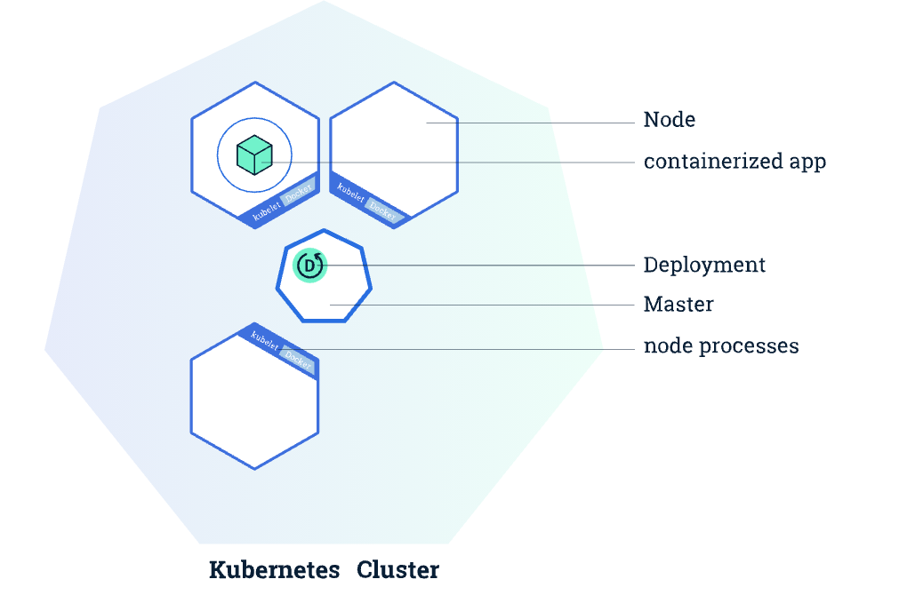

# KFServing

KFServing provides a Kubernetes [Custom Resource Definition](https://kubernetes.io/docs/concepts/extend-kubernetes/api-extension/custom-resources/) for serving machine learning (ML) models on arbitrary frameworks.


### Kubernetes Clusters

Kubernetes coordinates a highly available cluster of computers that are connected to work as a single unit. It automates the distribution and scheduling of application containers across a cluster in a more efficient way.

A Kubernetes cluster consists of two types of resources:

1. The **Master** coordinates the cluster. The Master is responsible for managing the cluster.
2. **Nodes** are the workers that run applications. A node is a VM or a physical computer that serves as a worker machine in a Kubernetes cluster.

``` bash
# Create a Cluster
minikube start # start to run Kubernetes
kubectl version # kubectl: interacting with Kubernetes
kubectil get nodes # Show all nodes that can be used to host the applications

```

We can deploy the containerized applications on top of it. To do so, you create a Kubernetes **Deployment** configuration. It instructs Kubernetes how to create and update instances of your application.



``` bash
# common format: kubectl [action] [resource]
kubectl create deployment kubernetes-bootcamp --image=gcr.io/google-samples/kubernetes-bootcamp:v1
kubectl get deployments # List the deployments
```


 A Pod is a Kubernetes abstraction that represents a group of one or more application containers (such as Docker), and some shared resources for those containers. Resources are:

1. Shared storage, as Volumes
2. Networking, as a unique cluster IP address
3. Information about how to run each container, such as the container image version or specific ports to use

A Pod always runs on a **Node**. A Node is a worker machine in Kubernetes and may be either a virtual or a physical machine, depending on the cluster.


``` bash
kubectl get namespaces
kubectl get pods -n [namespace]
kubectl describe pods
```

yaml规则

``` yam
＃ 第一段
apiVersion: vl 
kind: Pod 
metadata:
	name: <string> 
	namespace: [string] 
	labels:
		－ name: [string] 
  annotations:
		- name: [string]
＃ 第二段
spec :
	containers:
	- name: <string> 
	  image: <string> 
	  imagePullPolicy: [Always|Never|IfNotPresent]
	  command: [string] 
	  args: [string) 
	  workingDir: [string) 
	  volumeMounts:
		- name: <string> 
			mountPath: <string> 
			readOnly: [true|false)
```


### Architecture

在 Kubenetes 中， Service 是分布式集群架构的核心。 它是一种抽象的概念，每一个 Service 的后 端有多个 Pod ， 所有的容器均在 Pod 中运行。

每个 Service 拥有一个唯一指定的名字，拥有一个虚拟 IP 和相应的端口号.

Kubernetes 的 Node 节点主要由三个模块组成： kubelet 、 kube-proxy 、 runtime。

1. Kubelet。 Kubelet 是 Master 在每个 Node 节点上的 agent ，是 Node 与 Master 通信的重要途径。
2. Kube-proxy。 该模块实现了 Kubernetes 中的服务发现和反向代理功能。
3. runtimeo runtime 指的是容器运行环境，目前 Kubernetes 支持 Docker 和 Rocket


### Knative & Istio

KFServing currently requires Knative Serving for auto-scaling, canary rollout, Istio for traffic routing and ingress.

Knative & Lstio are foundmental layers for serverless and networking.


Knative provides a set of building blocks that enable declarative, container-based, serverless workloads on Kubernetes. Knative Serving proves primitives for serving platforms such as:

1. Event triggered functions on Kubernetes
2. Scale to and from zero
3. Queue based autoscaling for CPUs and TPUs. KNative autocaling by default provies inflight requests per pod
4. Traditional CPU autoscaling if desired. Traditional scaling hard for disparate devices (GPU, CPU, TPU)


Istio: An open service mesh platform to connect, observe, secure and control microservices.


### Analysis

``` bash
main.go: kfserving/cmd/manager/main.go
```

1. Parser

2. Get Config [Config](https://medium.com/@onexlab.io/golang-config-file-best-practise-d27d6a97a65a) 

   ``` go
   config.GetConfig()
   ```

3. Create manager controller [manager](https://github.com/kubernetes-sigs/controller-runtime/blob/master/pkg/manager/manager.go)

   ``` go
   manager.New()
   // Manager initializes shared dependencies such as Caches and Clients, and provides them to Runnables.
   // A Manager is required to create Controllers.
   
   func New(config *rest.Config, options Options) (Manager, error)
   // New returns a new Manager for creating Controllers.
   
   mgr, err := manager.New(cfg, manager.Options{MetricsBindAddress: metricsAddr, Port: 9443})
   // cfg, err := config.GetConfig()
   // MetricsBindAddress:
   // MetricsBindAddress is the TCP address that the controller should bind to
   // for serving prometheus metrics.
   // It can be set to "0" to disable the metrics serving.
   ```

4. Setup controllers

   problem: [link](k8s.io/client-go/tools/record) 404 for func ```eventBroadcaster := record.NewBroadcaster()```

   

5. Creates a new Clientset for the given config.

​	  [link](https://godoc.org/k8s.io/client-go/kubernetes#NewForConfig)  func  ``` kubernetes.NewForConfig(mgr.GetConfig())```

​	``` func NewForConfig(c *rest.Config) (*Clientset, error)```

6. Setup trainedmodel controller

``` trainedModelEventBroadcaster := record.NewBroadcaster()```

7. Get web hook server

``` go
hookServer.Register("/mutate-pods", &webhook.Admission{Handler: &pod.Mutator{}})

func (s *Server) Register(path string, hook http.Handler)
// Register marks the given webhook as being served at the given path.
// It panics if two hooks are registered on the same path.
```

Controller logic in ```kfserving/pkg/controller```


``` go
// Parser
// Get Config
// Create manager controller
// Creates a new event broadcaster.
// Creates a new Clientset for the given config.
// Setup controllers
// Setup trainedmodel controller
// Get webhook server


package main

import (
	"flag"
	"sigs.k8s.io/controller-runtime/pkg/client/config"
	"sigs.k8s.io/controller-runtime/pkg/manager"
	"k8s.io/client-go/tools/record"
	"k8s.io/client-go/kubernetes"
	typedcorev1 "k8s.io/client-go/kubernetes/typed/core/v1"


)

func main() {
	var flagAddr string
	flag.StringVar(&flagAddr, "Address", ":8080", "The address the metric endpoint binds to.")
	flag.Parse()

	// GetConfig creates a *rest.Config for talking to a Kubernetes API server. If --kubeconfig 
	// is set, will use the kubeconfig file at that location. Otherwise will assume running in 
	// cluster and use the cluster provided kubeconfig.
	cfg, err := config.GetConfig()

	// New returns a new Manager for creating Controllers.
	mng, err := manager.New(cfg, manager.Options(MetricsBindAddress: flagAddr, Port: 9443))

	// Creates a new event broadcaster.
	eventBroadcaster = record.NewBroadcaster()

	// NewForConfig creates a new Clientset for the given config. If config's RateLimiter is not 
	// set and QPS and Burst are acceptable, NewForConfig will generate a rate-limiter in configShallowCopy.
	clentSet, err := kubenetes.NewForConfig(mng.GetConfig())

	// EventSink knows how to store events (client.Client implements it.)
	// EventSink must respect the namespace that will be embedded in 'event'.
	// It is assumed that EventSink will return the same sorts of errors as
	// func (c *CoreV1Client) Events(namespace string) EventInterface
	eventSink := &typedcorev1.EventSinkImpl{Interface: clientSet.CoreV1().Events("")}
	// StartRecordingToSink starts sending events received from this EventBroadcaster to the given
	// sink. The return value can be ignored or used to stop recording, if desired.
	eventBroadcaster.StartRecordingToSink(eventSink)

	trainedModelEventBroadcaster = record.NewBroadcaster()

	eventSink := &typedcorev1.EventSinkImpl{Interface: clientSet.CoreV1().Events("")}
	trainedModelEventBroadcaster.StartRecordingToSink(eventSink)

	// GetWebhookServer returns a webhook.Server
	server := mng.GetWebhookServer()
	// Register marks the given webhook as being served at the given path. It panics if two hooks are 
	// registered on the same path.
	server.register()

}
```


Controller: 在K8S 拥有很多controller 他们的职责是保证集群中各种资源的状态和用户定义(yaml)的状态一致, 如果出现偏差, 则修正资源的状态.

Controller manager: controller manager 是各种controller的管理者,是集群内部的管理控制中心.

Event: 它存储在Etcd里，记录了集群运行所遇到的各种大事件。

Webhook: WebHook 是一种 HTTP 回调：某些条件下触发的 HTTP POST 请求；通过 HTTP POST 发送的简单事件通知。一个基于 web 应用实现的 WebHook 会在特定事件发生时把消息发送给特定的 URL. 具体来说，当在判断用户权限时，`Webhook` 模式会使 Kubernetes 查询外部的 REST 服务。


### client-go

``` go
import "k8s.io/client-go/kubernetes"
```

RESTClient: Uniform Interface The uniform interface constraint defines the interface between clients and servers.


```
--| pkg
--| --| controller
--| --| --| v1alpha2
--| --| --| --| inferenceservice
--| --| --| --| --| reconcilers
--| --| --| --| --| --| istio
--| --| --| --| --| --| --| virtualservice_reconciler.go
--| --| --| --| --| --| knative
```

``` 
1. 
controller/v1alpha2/inferenceservice/controller.go

func Reconcile:
  get inference service
  get config
  reconcilers using knative.NewServiceReconciler and istio.NewVirtualServiceReconciler
  update service status

func InferenceServiceReadiness:
	return if ready
	
func updateStatus:
	get existing inference service
	get namespace
	get if existing is ready
	check if existing is equal to desired
	get if desired is ready
	if desired not ready && existing ready, move to unready
	else if desired ready && existing ready, move to ready
	
2. 
controller/v1alpha2/inferenceservice/reconcilers/knative/service_reconciler.go

func NewServiceReconciler:
	create servcereconciler
	
func Reconcile:
	loop reconciler inferenceservice component with canery false
	loop reconciler inferenceservice component with canery true
	
func reconcileComponent:
	get endpointSpec
	get servicename
	create inferene service component
	if created is nil finalize Service and propagate status
	else reconcile service and propagate status
	
func finalizeService:
	get existing service
	delete it

func reconcileService:
	get existing service
	return if no differences to reconcile
	get diff from desired.Spec.ConfigurationSpec and existing.Spec.ConfigurationSpec
	desired configuration Spec and ObjectMeta labels -> existing
	本质上就是把desired 赋值赋给existing
	
func semanticEquals:
	deepequal of two service
	
3. controller/v1alpha2/inferenceservice/reconcilers/istio/virtualservice_reconciler.go

func NewVirtualServiceReconciler
	create virtual service reconciler
	
func Reconcile:
	create virtual service -> desired
	reconcileExternalService inference service
	reconcileVirtualService with desired
	propagate route status
	
func reconcileExternalService:
	desired = corev1.Service{with spec}
	existing = corev1.Service
	check if equal
	get dif from two spec
	existing.Spec = desired.Spec
	existing.ObjectMeta.Labels = desired.ObjectMeta.Labels
	existing.ObjectMeta.Annotations = desired.ObjectMeta.Annotations
	update
	
func reconcileVirtualService:
	existing = virtualservice
	check if equal
	get diff from two spec
	existing.Spec = desired.Spec
	existing.ObjectMeta.Labels = desired.ObjectMeta.Labels
	existing.ObjectMeta.Annotations = desired.ObjectMeta.Annotations
	update
	
4. 	
controller/v1beta1/inferenceservice/controller.go

func Reconcile:
	get v1beta1api inference service
	get new service config
	reconcilers using newpredictor
	if transformer is not none, append it
	if expaliner is not none, append it
	get ingressconfig
	get infressreconciler
	update serice status
	
	

```

